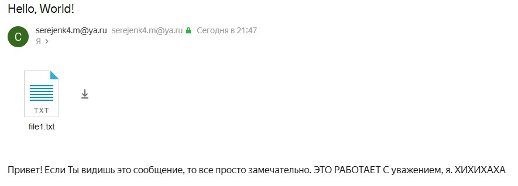

SMTP Client
===========

Автор: Мартьянов Сергей КН-202

Принцип работы
--------------

SMTP-клиент работает на основе протокола SMTP, который является стандартным протоколом для отправки электронной почты. Он взаимодействует с SMTP-сервером, который принимает и доставляет письма.

Процесс отправки письма с помощью SMTP Client включает следующие шаги:

1.  Установка соединения: SMTP-клиент устанавливает защищенное SSL/TLS-соединение с SMTP-сервером, используя указанный хост и порт в настройках. Это обеспечивает безопасную передачу данных.
    
2.  Авторизация: Клиент отправляет команду EHLO или HELO для приветствия сервера. Затем он отправляет команду AUTH LOGIN, чтобы начать процесс авторизации. Логин и пароль отправителя кодируются в формате Base64 и передаются серверу для проверки подлинности.
    
3.  Указание отправителя и получателей: SMTP-клиент отправляет команду MAIL FROM, указывая адрес отправителя. Затем для каждого получателя из списка адресов (указанных в файле `data.json`) отправляется команда RCPT TO. Таким образом, клиент указывает серверу, кому нужно доставить письмо.
    
4.  Передача данных письма: SMTP-клиент отправляет команду DATA для начала передачи текста письма. В этой команде клиент указывает заголовки письма (включая тему, адреса отправителя и получателей), а затем передает текст письма и вложения.
    
5.  Обработка и доставка письма: SMTP-сервер получает письмо от клиента, обрабатывает его и доставляет получателям. Сервер может проверять адреса получателей, фильтровать спам или производить другие операции в соответствии с настройками.
    
6.  Завершение соединения: После успешной отправки письма клиент закрывает соединение с сервером, чтобы освободить ресурсы.
    

Настройка приложения
--------------------

Для настройки приложения необходимо внести соответствующие значения в три файла, расположенные в папке `settings`:

1.  `config.json` - файл с настройками SMTP-сервера. Пример содержимого и указания хоста и порта:

```json
{
  "smtp_host": "smtp.example.com", 
  "smtp_port": 465
}
```

2.  `credentials.json` - файл с учетными данными отправителя. Пример содержимого и указания логина и пароля:

```json
{   
  "login": "sender@example.com",   
  "password": "your_password" 
}
```

3.  `data.json` - файл с данными о письме, получателях и вложениях. Пример содержимого:

```json
{   
  "to_addrs": ["recipient@example.ru"],   
  "message": {     
    "subject": "Subject",    
    "message_file_path": "example_msg.txt",     
    "attachment_folder_path": "attachments"
  }
}
```
После настройки приложения запустите `main.py` для выполнения попытки отправки письма.   


Пример использования:
--------------

1.  Настроим файл `config.json`:

```json
{     
  "smtp_host": "smtp.yandex.ru",     
  "smtp_port": 465
}
```

2.  Настроим файл `data.json`:

```json
{   
  "to_addrs": ["мой адрес"],   
  "message": {     
    "subject": "Hello, World!",     
    "message_file_path": "msg.txt",     
    "attachment_folder_path": "attachments"
  }
}
```
3.  Запустим файл `main.py` для выполнения попытки отправки письма.
    
4.  После выполнения скрипта в консоли появился результат:

```shell
Message sent successfully
```



На скриншоте видно успешную отправку письма с указанными настройками и данными.
